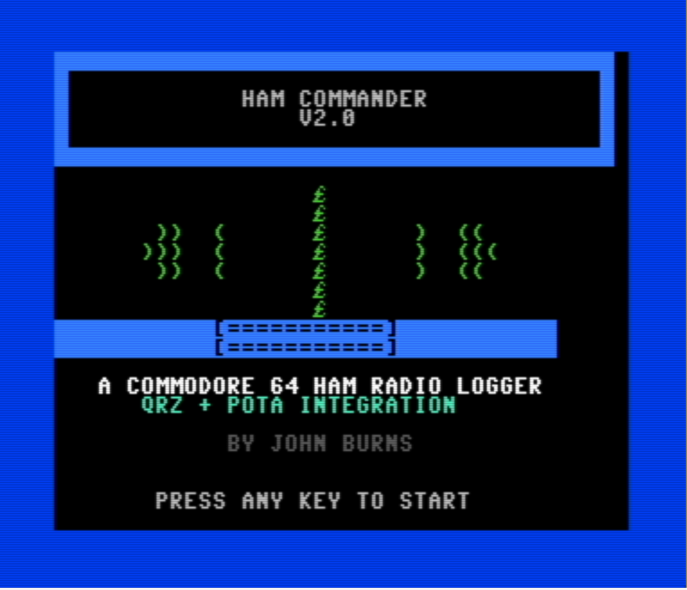
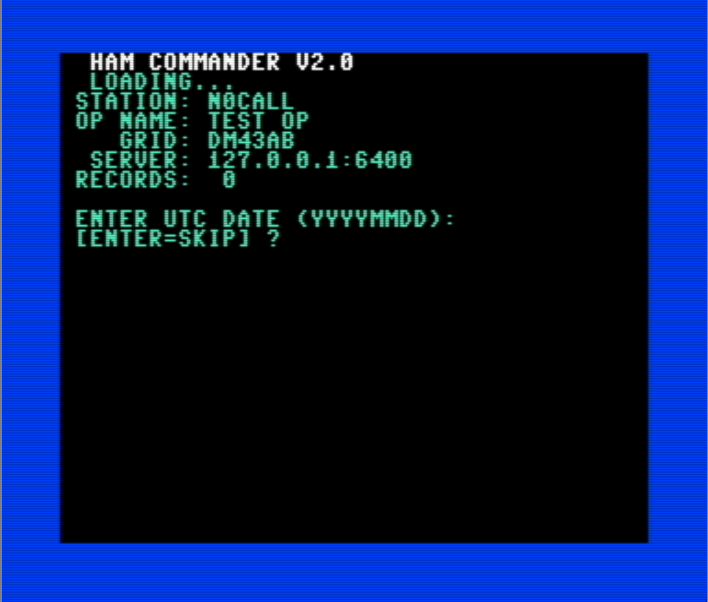
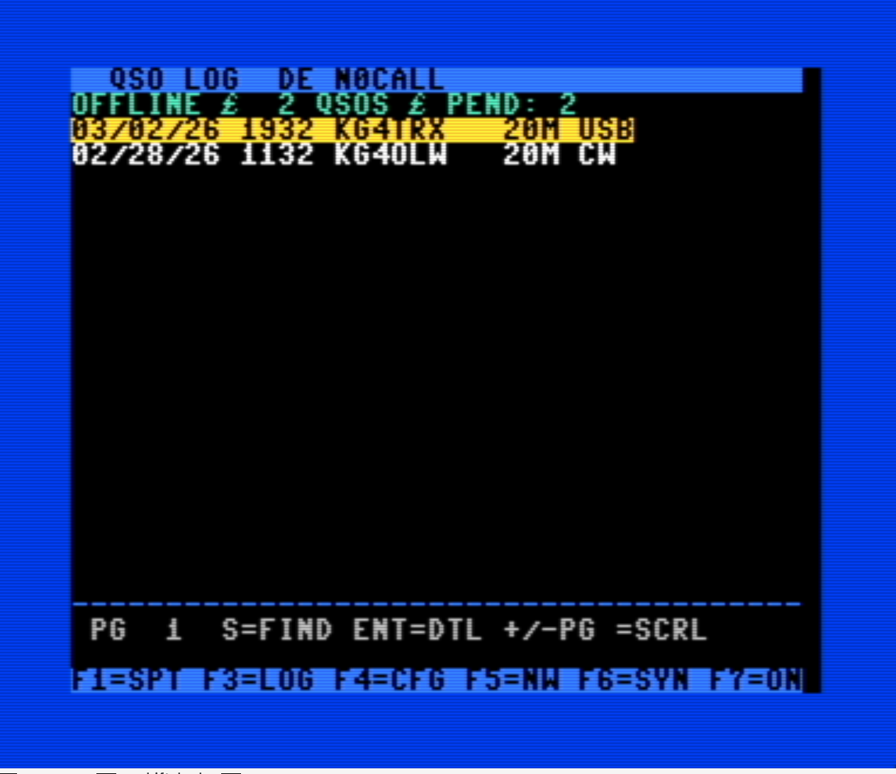
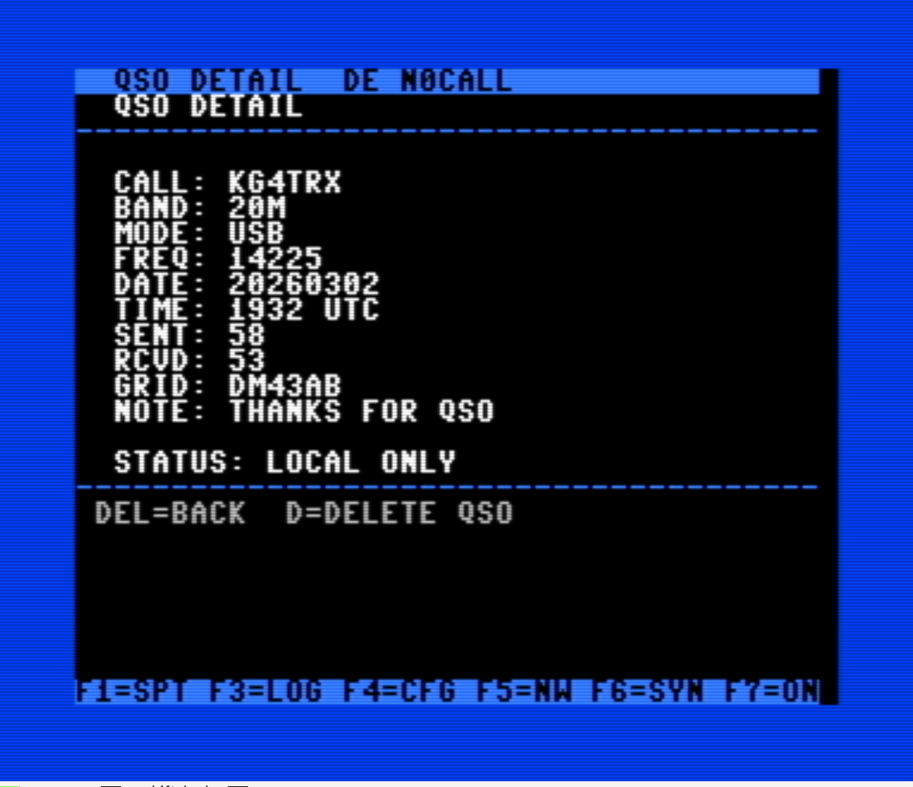
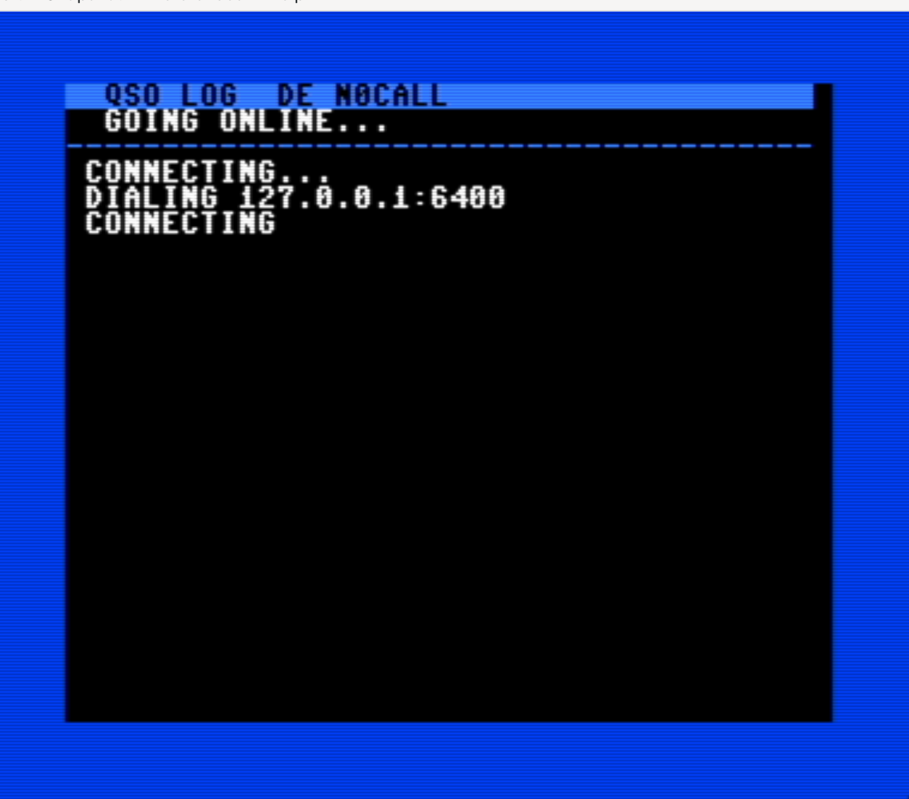
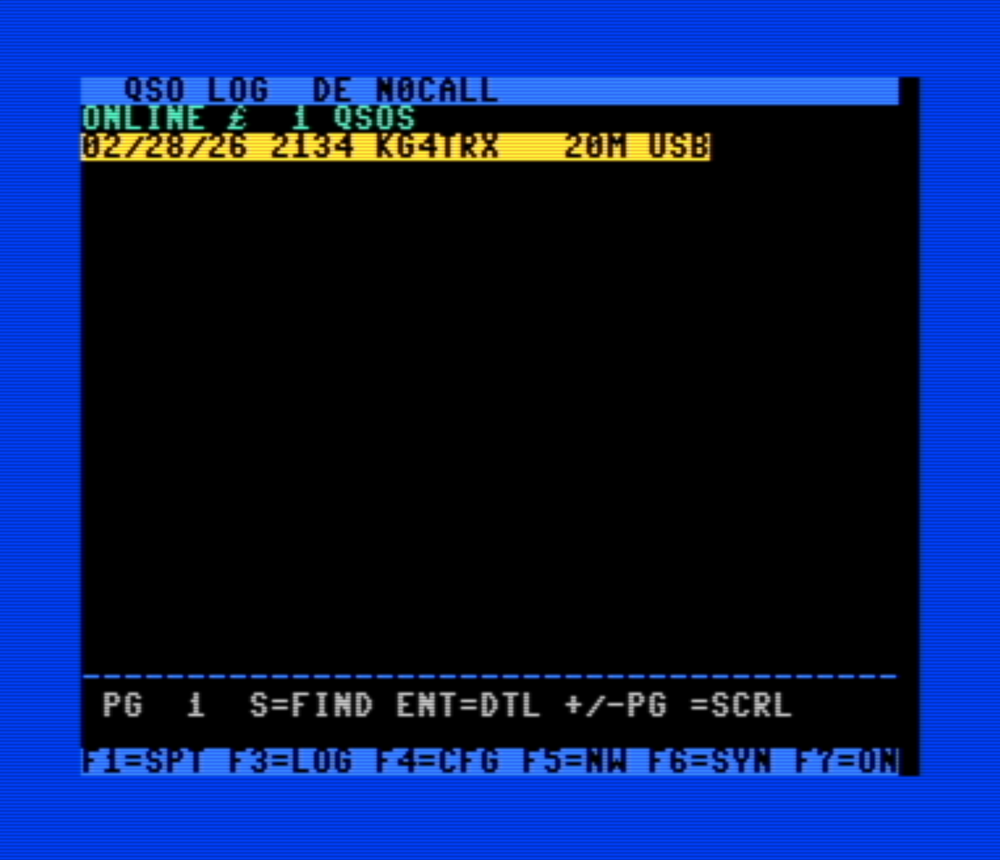
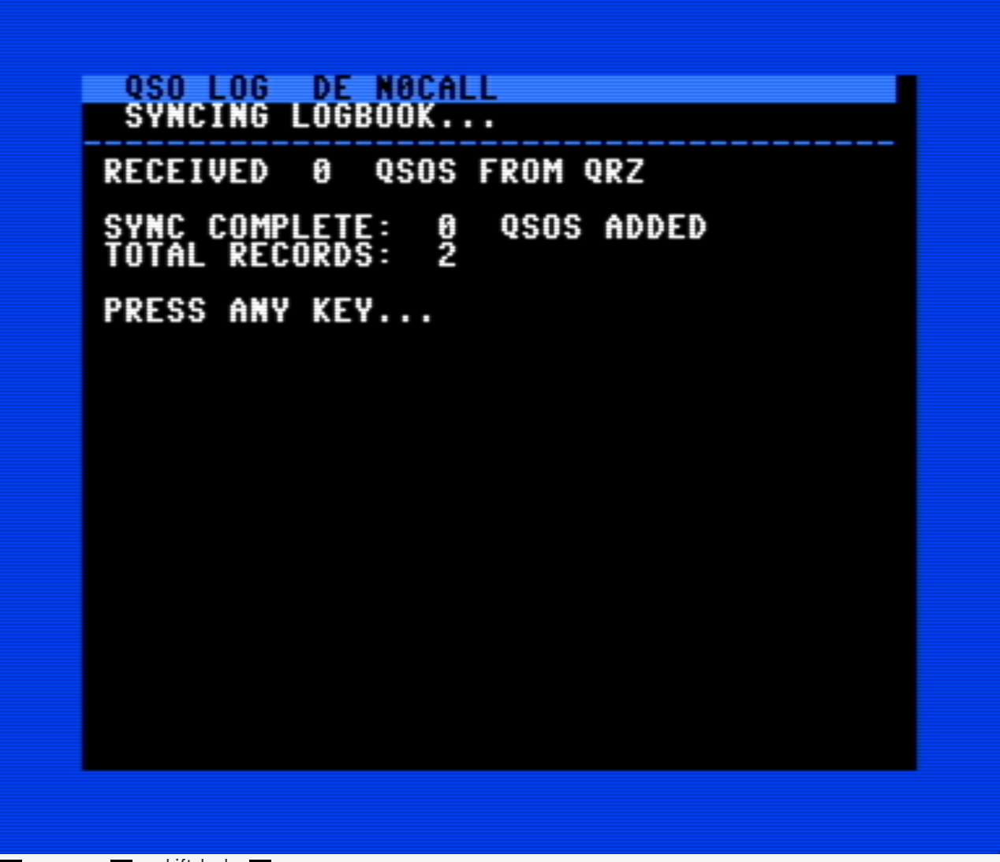
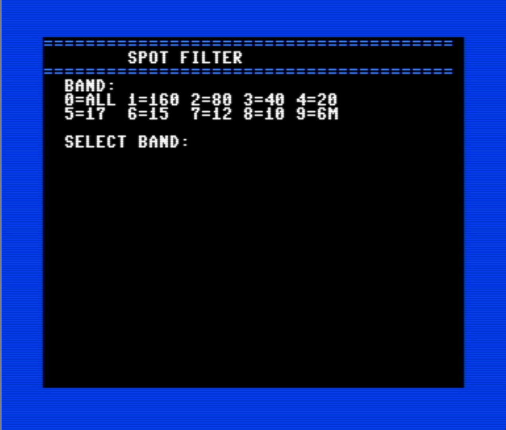
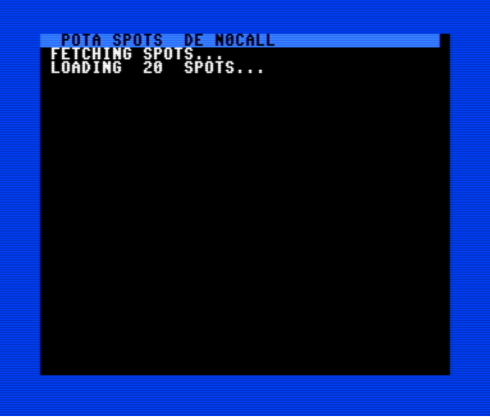
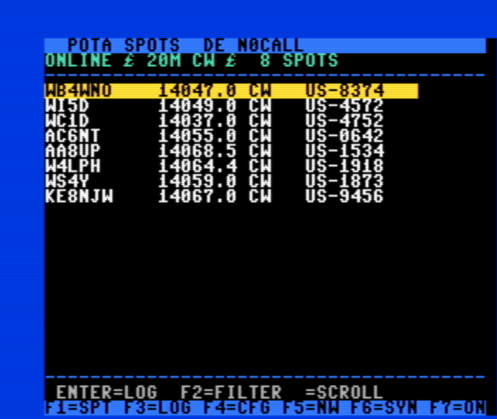

# Ham Commander v2.1

A Commodore 64 ham radio logging application with local disk storage and optional online features via an RS232 modem connection.



```
┌──────────────────────┐     RS232      ┌───────────────┐     TCP      ┌──────────┐
│  Commodore 64        │◄──(1200 baud)──│  PTY Bridge   │◄────────────►│  Server  │
│  c64_hamlog.bas      │   /tmp/c64modem│  pty_bridge.py │              │ server.py│
│                      │                └───────────────┘              └────┬─────┘
│  1541/1581/SD2IEC    │                                                   │
│  HAMLOG.DAT (REL)    │     SwiftLink/ACIA     ┌──────────┐     WiFi     │
│  HAMLOG.SUM (REL)    │◄──(up to 19200 baud)──►│WiFi Modem│◄────────────►│
│  HAMLOG.IDX (SEQ)    │    $DE00 + NMI buffer  └──────────┘              │
│  HAMLOG.CFG (SEQ)    │                                          ┌────────┴────────┐
│                      │                                          │  QRZ.com API    │
│                      │                                          │  POTA Spots API │
└──────────────────────┘                                          └─────────────────┘
```

## Features

- **Local logging** — Log QSOs directly on the C64 with full REL file storage on 1541 (D64) or 1581/SD2IEC (D81) drives
- **QRZ callsign lookups** — Look up name, location, and grid square via RS232 modem
- **POTA spots** — View Parks on the Air activations with band/mode filtering; select a spot and log it directly as a new QSO
- **Log search** — Search your logbook by callsign prefix (press "s" on the log screen)
- **QRZ sync** — Incremental sync of your QRZ logbook to the C64
- **Reverse-chronological log** — Newest QSOs shown first, with paged browsing
- **Archive & multi-disk** — Capacity tracking with warnings, archive to new disk from the config menu, and navigate between disks with `<` / `>` on the log screen

## Screenshots

### Startup & Configuration

On first launch, the setup wizard walks you through station configuration. On subsequent launches, the startup screen shows your station info and record count, and prompts for the current UTC date/time.



### QSO Log Browser

The log browser (F3) shows your QSOs in reverse chronological order (newest first). Use cursor keys to scroll, +/- to page, Enter to view details, and "s" to search by callsign.



### QSO Detail View

Press Enter on any QSO to see the full detail including frequency, grid square, name, country, and sync status. From here you can delete the QSO with "d".



### Going Online

Press F7 to connect to the server via RS232 modem. The C64 dials the configured server address and establishes a connection.



### Online Log View

When connected, the status bar shows "ONLINE" and you can sync with QRZ, look up callsigns, and fetch POTA spots.



### QRZ Sync

Press F6 to sync your logbook with QRZ. Any pending local QSOs are uploaded first, then new QSOs from QRZ are downloaded with a per-record ACK handshake to prevent buffer overruns.



### POTA Spots

Press F1 when online to fetch live Parks on the Air spots. Use F2 to filter by band and/or mode. Select any spot and press Enter to log it directly as a new QSO — the callsign, frequency, mode, and band are pre-filled from the spot data.







## Prerequisites

- **Python 3.10+** with pip
- **VICE emulator** (provides `petcat`, `c1541`, and `x64sc`)
  ```bash
  brew install vice        # macOS
  apt install vice         # Debian/Ubuntu
  ```
- **Python packages**:
  ```bash
  pip install -r requirements.txt
  ```

## Quick Start

There are three ways to get started, depending on your situation:

### Path 1: Fresh Start (No Existing Log)

Create a blank disk image with the program and empty pre-allocated log files:

```bash
# D81 disk (1581/SD2IEC — holds up to 3,500 QSOs)
python3 create_disk.py --callsign YOURCALL --name "Your Name" --grid AB12cd

# D64 disk (1541 — holds up to 700 QSOs)
python3 create_disk.py --format d64 --callsign YOURCALL --name "Your Name" --grid AB12cd
```

This builds the PRG automatically from `c64_hamlog.bas` and creates a ready-to-use disk image with pre-allocated REL files. No Commodore DOS extension needed — just load and go.

### Path 2: Import from ADIF (QRZ Export, etc.)

If you have an ADIF log file (exported from QRZ, LOTW, or another logger):

```bash
# Import into a D81 (auto-splits if >3,500 QSOs)
python3 import_adif.py --adif yourlog.adi --callsign YOURCALL --name "Your Name" --grid AB12cd

# Import into D64 disks (auto-splits if >700 QSOs)
python3 import_adif.py --adif yourlog.adi --format d64 --callsign YOURCALL

# Skip the last N records (useful for testing sync)
python3 import_adif.py --adif yourlog.adi --skip-last 50
```

For large logs, the tool automatically creates numbered disk images:
```
hamlog-01.d81  (records 1-3500)
hamlog-02.d81  (records 3501-7000)
hamlog-03.d81  (records 7001-8200)
```

Each disk is self-contained with the program, data, config, and index.

### Path 3: PRG Only (For Existing Disks)

If you already have a disk image and just want the compiled program:

```bash
python3 create_disk.py --prg-only
```

This produces `c64_hamlog.prg` which you can copy to any disk using c1541:

```bash
# Copy PRG to an existing D81
c1541 -attach yourdisk.d81 -write c64_hamlog.prg "hamlog"

# Copy PRG to an existing D64
c1541 -attach yourdisk.d64 -write c64_hamlog.prg "hamlog"
```

Note: The disk must already have HAMLOG.DAT, HAMLOG.SUM, HAMLOG.IDX, and HAMLOG.CFG files. Use the setup wizard (first run) to create config, or copy these from a disk created by `create_disk.py`.

## Running in VICE Emulator

### Offline Mode (No Server)

```bash
# D81 disk
GSETTINGS_SCHEMA_DIR=/opt/homebrew/share/glib-2.0/schemas x64sc \
  -drive8truedrive -autostart hamlog.d81 -autostartprgmode 1

# D64 disk
GSETTINGS_SCHEMA_DIR=/opt/homebrew/share/glib-2.0/schemas x64sc \
  -drive8truedrive -autostart hamlog.d64 -autostartprgmode 1
```

The `-drive8truedrive` flag enables true drive emulation (TDE), which is required for REL file support. VICE saves this setting persistently — if you previously disabled TDE, you must re-enable it explicitly.

### Online Mode (With Server)

Start three terminals:

**Terminal 1 — Server:**
```bash
python3 -u server.py
```

**Terminal 2 — PTY Bridge:**
```bash
python3 -u pty_bridge.py
```

**Terminal 3 — VICE:**
```bash
GSETTINGS_SCHEMA_DIR=/opt/homebrew/share/glib-2.0/schemas x64sc \
  -rsdev1 "/tmp/c64modem" +rsdev1ip232 -rsdev1baud 1200 \
  -userportdevice 2 -rsuserdev 0 -rsuserbaud 1200 +acia1 \
  -drive8truedrive -autostart hamlog.d81 -autostartprgmode 1
```

## Running on Real Hardware

### SwiftLink / ACIA Modem Support (Ultimate 64, etc.)

The program auto-detects a SwiftLink-compatible ACIA chip at $DE00 on startup. When detected, it loads a 146-byte NMI-driven receive buffer into $C000, allowing reliable serial communication at any baud rate up to 19200.

- **Auto-detection** — Writes a test value to the ACIA control register and reads it back. Falls back to KERNAL userport RS232 if no ACIA is found (VICE compatibility).
- **NMI receive buffer** — 256-byte ring buffer filled by interrupt, so no bytes are lost even at 9600+ baud. BASIC polling can't keep up with 9600 baud on a 1-byte ACIA buffer, so the NMI handler is essential.
- **Configurable baud rate** — Set via F4 config editor (option 6). Supported: 300, 1200, 2400, 4800, 9600 (default), 19200.

**Setup with Ultimate 64 WiFi modem:**

1. Configure the modem for ACIA/SwiftLink mode at $DE00/NMI
2. Set the modem serial speed to match your config (default 9600)
3. Copy `hamlog.d81` to your SD card
4. Update the server IP via F4 on the C64
5. Start the Python server on your PC: `python3 -u server.py`
6. Press F7 on the C64 to go online

### SD2IEC

Copy the `.d81` file to your SD card. Mount it on the SD2IEC and load:

```
LOAD "HAMLOG",8,1
RUN
```

### 1581 Drive

Write the `.d81` to a 3.5" disk using an appropriate transfer tool, or use an SD2IEC in D81 mode.

### 1541 Drive

Use a D64 disk image. The 1541 supports REL files natively (no super side sector needed). Transfer the `.d64` to a 5.25" disk.

## Server Configuration

The server requires a `.env` file for QRZ API access:

```bash
cp .env.example .env
# Edit .env with your QRZ credentials:
#   QRZ_USER=yourcall
#   QRZ_PASS=yourpassword
#   QRZ_API_KEY=your_api_key  (for logbook access)
```

The server listens on port 6400 by default and provides:
- `HELLO` — Connection handshake
- `LOOKUP,callsign` — QRZ callsign lookup
- `SPOTS[,band][,mode]` — POTA spot feed (filtered, max 20)
- `SYNC,last_logid` — Incremental logbook sync from QRZ
- `ADD,call,band,mode,...` — Upload QSO to QRZ logbook

## C64 Usage

### F-Key Controls

| Key | Function |
|-----|----------|
| F1 | POTA Spots (with band/mode filter when online) |
| F2 | Filter spots by band/mode (from spot screen) |
| F3 | Log Browser (newest first) |
| F4 | Configuration Editor + Archive Disk |
| F5 | New QSO Entry |
| F6 | Sync with QRZ (when online) |
| F7 | Go Online / Offline |

### Log Browser

- **Cursor Up/Down** — Move selection
- **+/-** — Page forward/backward
- **Enter** — View QSO detail
- **S** — Search by callsign
- **D** — Delete QSO (from detail view)
- **< / >** — Navigate to previous/next archive disk
- Records are displayed newest-first

### POTA Spots to QSO

When viewing POTA spots (F1), press **Enter** on any spot to start a new QSO entry with the activator's callsign, frequency, mode, and band pre-filled. Just confirm the date/time, RST, and save.

### Screen Layout

```
Row 0:  Title bar (reverse video)
Row 1:  Status line
Rows 2-20: Data area (19 rows)
Row 21: Separator
Row 22: Help text
Row 24: F-key bar
```

## Disk Capacity & Archiving

| Format | Drive | Max QSOs | Disk Images for 10K QSOs |
|--------|-------|----------|--------------------------|
| D81 | 1581 / SD2IEC | 3,500 | 3 disks |
| D64 | 1541 | 700 | 15 disks |

Each disk image is self-contained — program, data, config, and index are all included. Multi-disk import numbers them sequentially (`hamlog-01.d81`, `hamlog-02.d81`, etc.).

The status bar shows capacity percentage when a disk is more than 80% full. When a disk reaches capacity, new QSOs are blocked and you're directed to archive. Press F4 and select option 7 to format a new disk — this resets the log, keeps your station config, and increments the disk number. Use `<` and `>` on the log screen to navigate between archive disks.

### SD2IEC Setup

For SD2IEC users, pre-create sequential blank disk images and copy them to your SD card:

```bash
# Create 5 blank disks: hamlog-01.d81 through hamlog-05.d81
python3 create_disk.py --callsign YOURCALL --name "Your Name" --grid AB12cd --count 5
```

The C64 automatically switches between disk images using SD2IEC `CD:` commands. On real 1581 drives, it falls back to a manual "insert disk" prompt.

## File Reference

| File | Description |
|------|-------------|
| `c64_hamlog.bas` | C64 BASIC source code |
| `bas_lower.py` | Lowercases BASIC keywords (preserves string literals) |
| `diskimage.py` | Shared D81/D64 disk image builder library |
| `create_disk.py` | Creates blank disk images with PRG + empty REL files |
| `import_adif.py` | Imports ADIF logs into disk images (multi-disk capable) |
| `server.py` | Asyncio TCP server (QRZ lookups, POTA spots, sync) |
| `pty_bridge.py` | Bridges VICE RS232 PTY to TCP server |
| `acia_driver.asm` | Documented 6502 assembly source for SwiftLink ACIA driver + ML readline |
| `DISK_FORMAT.md` | Deep-dive technical reference for D81/D64/REL file formats |
| `CLAUDE.md` | Developer reference (line ranges, variables, record formats) |

## Troubleshooting

### "DEVICE NOT PRESENT" error
VICE TDE (True Drive Emulation) is off. VICE saves drive settings persistently. Use `-drive8truedrive` explicitly when launching.

### Drive hangs / freezes on large files
If using a custom disk image, verify the POSITION command high byte calculation: `hi=int(rn/256)` — do NOT add +1. See DISK_FORMAT.md for details.

### Garbled text on screen (graphics characters)
Data contains lowercase ASCII. All data sent to the C64 must be uppercased. The server's `sanitize_csv()` and import scripts handle this automatically.

### "STRING TOO LONG" error
The RS232 readline buffer (`rl$`) has a 250-char guard. If the server sends lines longer than 255 bytes, they'll be truncated. This shouldn't happen with normal data.

### VICE RS232 not connecting
On macOS ARM (Apple Silicon), VICE 3.10's IP232 mode is broken. Use the PTY bridge approach with `+rsdev1ip232` (note the `+` to disable IP232).
